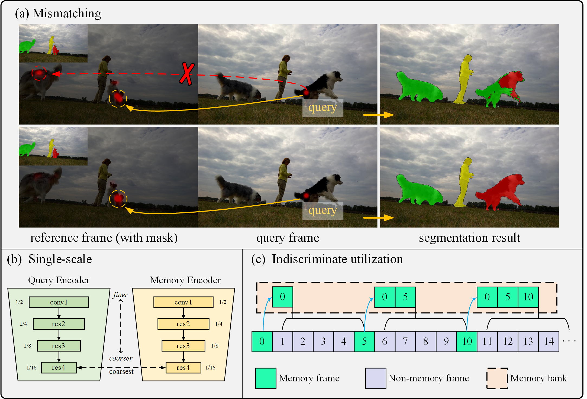
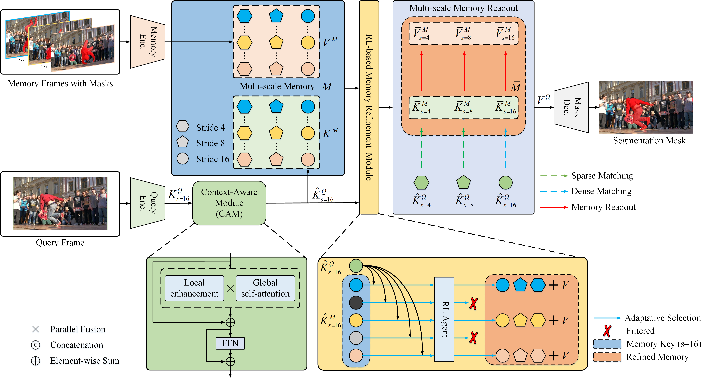

# BMN: **Boosting Memory Network for Video Object Segmentation in Complex Scenes**

### Introduction



### Overview



### Results


### Training/inference

Required python packages:

* Python 3.8+
* PyTorch 1.11+ 
* `torchvision` corresponding to the PyTorch version
* OpenCV (try `pip install opencv-python`)
* Others: `pip install -r requirements.txt`

For training:

```
-- first: train VOS models
python -m torch.distributed.run --master_port 25763 --nproc_per_node=2 train.py --exp_id retrain --stage 03

-- second: train RL agents
python train_agent.py
```

For inference:

DAVIS 2017 validation:

```
python eval.py --output ../output/d17 --dataset D17
```

DAVIS 2016 validation:

```
python eval.py --output ../output/d16 --dataset D16
```

DAVIS 2017 test-dev:

```
python eval.py --output ../output/d17-td --dataset D17 --split test
```

YouTubeVOS 2018 validation:

```
python eval.py --output ../output/y18 --dataset Y18
```

YouTubeVOS 2019 validation:

```
python eval.py --output ../output/y19 --dataset Y19
```

MOSE validation:

```
python eval.py --output ../output/mose --dataset G
```


Contact: <yiyuhang@stu.csust.edu.cn>

